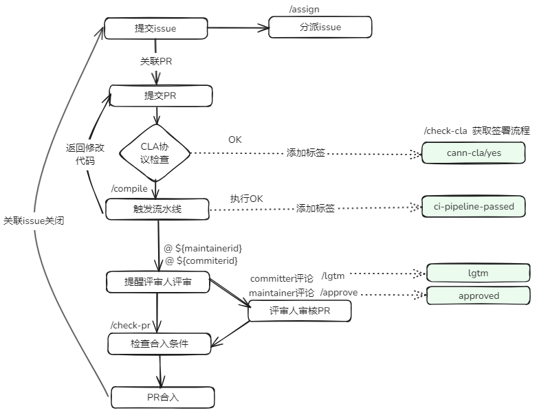

****

##  🚀 CANN社区用户交互流程

CANN社区中所有项目均由Bot维护，这意味着开发人员可以在每个Pull Request或者Issue下面可以通过评论触发Bot命令， 主要交互流程图如下：

## 🎯 如需了解详细的命令，可参考下方详细表格

<table class="command">
    <thead>
        <tr>
            <th width="15%">命令</th>
            <th width="15%">示例</th>
            <th width="10%">使用范围</th>
            <th width="30%">描述</th>
            <th width="15%">面向对象</th>
            <th width="15%">使用仓库</th>
        </tr>
    </thead>
    <tbody>
        <tr>
            <td>
                /check-cla
            </td>
            <td style="white-space:nowrap;">
                /check-cla
            </td>
            <td>
                <strong>Pull Request</strong>
            </td>
            <td>
                强制重新检查Pull Request的CLA状态。
                如果Pull Request的提交者已经签署了CLA协议，则<strong>cann-cla/yes</strong>标签将会被添加到Pull Request中；如果没有，则标签<strong>cann-cla/no</strong>将被添加到Pull Request中。
            </td>
            <td>
                所有开发者
            </td>
            <td>
                所有仓库
            </td>
        </tr>
        <tr>
            <td>
                /cla cancel
            </td>
            <td style="white-space:nowrap;">
                /cla cancel
            </td>
            <td>
                <strong>Pull Request</strong>
            </td>
            <td>
                强制删除<strong>cann-cla/yes</strong>标签。
            </td>
            <td>
               仓库管理员
            </td>
            <td>
                所有仓库  
            </td>
        </tr>
        <tr>
           <td>
                /compile
           </td>
           <td style="white-space:nowrap;">
                /compile
           </td>
           <td>
                <strong>Pull Request</strong>
            </td>
           <td>
                触发编译CodeArts流水线。
                编译通过后，该Pull Request会被打上<strong>ci-pipeline-passed</strong>的标签。若编译失败，该Pull Request会被打上<strong>ci-pipeline-failed</strong>的标签。
           </td>
           <td>
              所有开发者
           </td>
           <td>
              所有仓库
           </td>
        </tr>
        <tr>
            <td>
                /lgtm
            </td>
            <td style="white-space:nowrap;">
                /lgtm
            </td>
            <td>
                <strong>Pull Request</strong>
            </td>
            <td>
                添加用于代表代码已经评审过的标签 <strong>lgtm</strong>。      
            </td>
            <td>
              仓库所属sig组的reviewers
            </td>
            <td>
                所有仓库
            </td>
        </tr>
        <tr>
            <td>
                /lgtm cancel
            </td>
            <td style="white-space:nowrap;">
                /lgtm cancel
            </td>
            <td>
                <strong>Pull Request</strong>
            </td>
            <td>
                移除用于代表代码已经评审过的标签<strong>lgtm</strong>。
            </td>
            <td>
              仓库所属sig组的reviewers
            </td>
            <td>
                所有仓库
            </td>
        </tr>
        <tr>
            <td>
                /approve
            </td>
            <td style="white-space:nowrap;">
                /approve
            </td>
            <td>
                <strong>Pull Request</strong>
            </td>
            <td>
                添加用于代表committers同意合并的标签 <strong>lgtm</strong>。      
            </td>
            <td>
              仓库所属sig组的committers
            </td>
            <td>
                所有仓库
            </td>
        </tr>
        <tr>
            <td>
                /approve cancel
            </td>
            <td style="white-space:nowrap;">
                /approve cancel
            </td>
            <td>
                <strong>Pull Request</strong>
            </td>
            <td>
                移除用于代表committers同意合并的标签<strong>approved</strong>。
            </td>
            <td>
              仓库所属sig组的committers
            </td>
            <td>
                所有仓库
            </td>
        </tr>
        <tr>
            <td>
                /check-pr
            </td>
            <td style="white-space:nowrap;">
                /check-pr
            </td>
            <td>
                <strong>Pull Request</strong>
            </td>
            <td>
                检查Pull Request中的标签是否满足条件，如果满足条件，则合并Pull Request。
            </td>
            <td>
                任何人都可以在Pull Request上触发此命令
            </td>
            <td>
                所有仓库
            </td>
        </tr>
        <tr>
            <td>
                /merge
            </td>
            <td style="white-space:nowrap;">
                /merge
            </td>
            <td>
                <strong>Pull Request</strong>
            </td>
            <td>
                添加用于代表branch_keeper同意合并的标签 <strong>keeper_approved</strong>。
            </td>
            <td>
                仓库对应分支的branch_keeper
            </td>
            <td>
                所有仓库
            </td>
        </tr>
        <tr>
            <td>
                /kind **
            </td>
            <td style="white-space:nowrap;">
                /kind bug, 
                 **可接受大小写字母、数字、中划线、下划线，
                 对于下面的**规则通用
            </td>
            <td>
                <strong>Pull Request</strong>
                 <strong>Issue</strong>
            </td>
            <td>
                添加标签 <strong>kind/bug</strong>。
            </td>
            <td>
                仓库管理员可以直接添加；其他人可以使用评论添加标签，如kind/AI，前提是仓库中必须存在此标签，否则添加不上
            </td>
            <td>
                所有仓库
            </td>
        </tr>
        <tr>
            <td>
                /remove-kind **
            </td>
            <td style="white-space:nowrap;">
                /remove-kind bug
            </td>
            <td>
                <strong>Pull Request</strong>
                 <strong>Issue</strong>
            </td>
            <td>
                移除标签 <strong>kind/bug</strong>。
            </td>
            <td>
                所有人
            </td>
            <td>
                所有仓库
            </td>
        </tr>
        <tr>
            <td>
                /priority **
            </td>
            <td style="white-space:nowrap;">
                /priority high
            </td>
            <td>
                <strong>Pull Request</strong>
                 <strong>Issue</strong>
            </td>
            <td>
                添加标签 <strong>priority/high</strong>。
            </td>
            <td>
                仓库管理员可以直接添加；其他人可以使用评论添加标签，如kind/AI，前提是仓库中必须存在此标签，否则添加不上
            </td>
            <td>
                所有仓库
            </td>
        </tr>
        <tr>
            <td>
                /remove-priority **
            </td>
            <td style="white-space:nowrap;">
                /remove-priority high
            </td>
            <td>
                <strong>Pull Request</strong>
                 <strong>Issue</strong>
            </td>
            <td>
                移除标签 <strong>priority/high</strong>。
            </td>
            <td>
                所有人
            </td>
            <td>
                所有仓库
            </td>
        </tr>
        <tr>
            <td>
                /sig **
            </td>
            <td style="white-space:nowrap;">
                /sig AI
            </td>
            <td>
                <strong>Pull Request</strong>
                 <strong>Issue</strong>
            </td>
            <td>
                添加标签 <strong>sig/AI</strong>。
            </td>
            <td>
                仓库管理员可以直接添加；其他人可以使用评论添加标签，如kind/AI，前提是仓库中必须存在此标签，否则添加不上
            </td>
            <td>
                所有仓库
            </td>
        </tr>
        <tr>
            <td>
                /remove-sig **
            </td>
            <td style="white-space:nowrap;">
                /remove-sig AI
            </td>
            <td>
                <strong>Pull Request</strong>
                 <strong>Issue</strong>
            </td>
            <td>
                移除标签 <strong>sig/AI</strong>。
            </td>
            <td>
                所有人
            </td>
            <td>
                所有仓库
            </td>
        </tr>
        <tr>
            <td>
                /assign [[@]...]
            </td>
            <td style="white-space:nowrap;">
                /assign 
                 /assign @cann-robot
            </td>
            <td>
                 <strong>Issue</strong>
            </td>
            <td>
                为Issue指派一位负责人。
            </td>
            <td>
                所有人
            </td>
            <td>
                所有仓库
            </td>
        </tr>
        <tr>
            <td>
                /unassign [[@]...]
            </td>
            <td style="white-space:nowrap;">
                /unassign 
                 /unassign @cann-robot
            </td>
            <td>
                 <strong>Issue</strong>
            </td>
            <td>
                取消Issue指派的负责人。
            </td>
            <td>
                所有人
            </td>
            <td>
                所有仓库
            </td>
        </tr>
    </tbody>
</table>