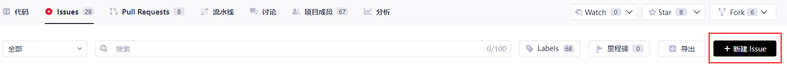
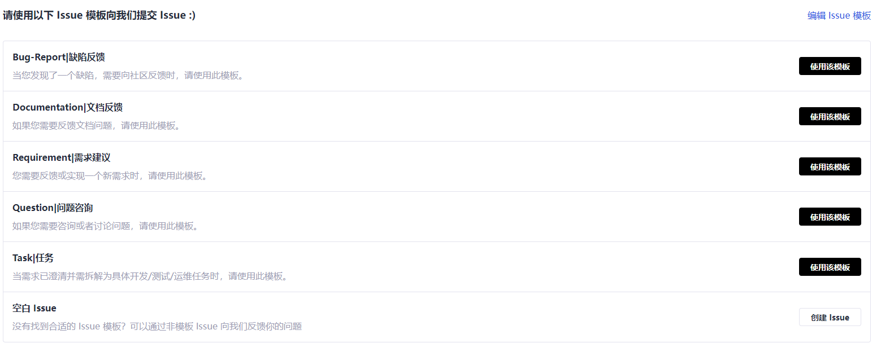
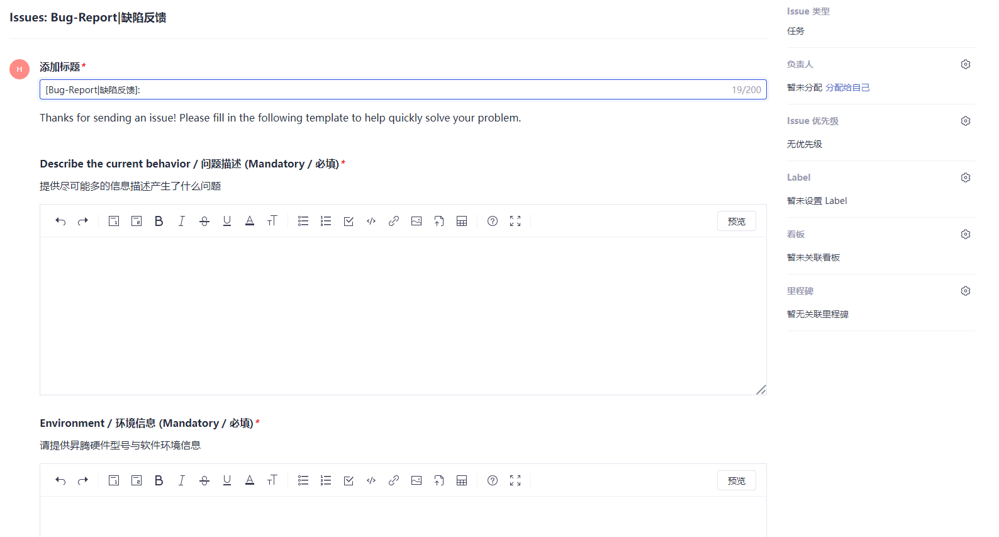

# Issue提交指南

CANN开放项目使用Gitcode提供的Issue跟踪和管理系统用于记录每一个用户问题的处理全流程。

下面介绍Issue的基本操作。

1. 新建Issue。

   Gitcode每一个源码仓都有Issue板块，在该板块中单击“新建Issue”，即可进入Issue类型选择界面。
   a. 单击“新建issue”。
     
   b. 根据自身诉求，选择Issue类型，并单击“立即开始”。
     
  
2. 填写Issue。

   在Issue填写界面中按照提示填写Issue相关信息，如下图所示：
   

   a. 填写Issue标题。

      请在标题栏**简要描述需求或者问题要点**。

   b. 详细填写Issue内容。

      选择相应的类型后，系统会自动给出填写模板，为方便我们解决您的需求或问题，请按照模板详细填写。

3. 提交Issue。

   Issue信息填写完成后，单击“创建”按钮，即完成Issue的创建。
   您无需填写负责人等其他信息，对应源码仓会有接口人定时审视Issue，并按照Issue类型进行分配。