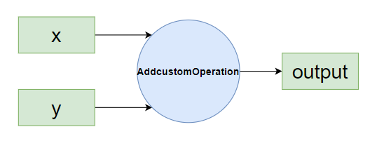

# Ascend Boost Comm 库开发单算子示例
本教程以add算子为例，提供能够基于Ascend Boost Comm运行的算子编写教程.

### 算子功能
两个输入张量在指定维度相加成一个输出张量。  

### 新增文件
- 在`examples/ops`下新增`addcustom`目录，该目录下主要存放算子实现部分的代码，文件具体内容见后文，目录结构如下：
    ```
    addcustom
    ├── op_kernel			        // device侧实现文件(包括核函数入口、以及实现文件)	
    │   └── addcustom.cpp
    ├── tiling			            // 新增算子tiling
    │   ├── addcustom_tiling.cpp	// tiling实现核心算法
    │   ├── addcustom_tiling.h		// 算子tiling接口
    │   └── tiling_data.h			// tiling和kernel传递结构体tiling_data的定义 
    ├── CMakeLists.txt			    // 新增算子编译CMake
    ├── addcustom_kernel.cpp		// 校验
    └── addcustom_operation.cpp		// shape验证
    ```

- 新增`example/include/asdops/params/addcustom.h`文件定义 `Addcustom` 操作的参数结构体，内容如下：
    ```c++
    #ifndef ATBOPS_PARAMS_ADDCUSTOM_H
    #define ATBOPS_PARAMS_ADDCUSTOM_H

    #include <cstdint>
    #include <string>
    #include <sstream>
    #include <mki/utils/SVector/SVector.h>

    namespace Mki {
    namespace OpParam {
    struct Addcustom {

        bool operator==(const Addcustom &other) const
        {
            (void)other;
            return true;
        }
    };

    } // namespace OpParam
    } // namespace Mki

    #endif

    #endif
    ```
### 修改文件
- 在`example/include/asdops/params/params.h`中包含新增的头文件`example/include/asdops/params/addcustom.h`:
    ```c++
    #include "atbops/params/addcustom.h"
    ```
## 环境准备

您可参考[环境准备](../README.md#环境构建)进行编译编译和测试环境搭建，环境准备好之后，就可以开始算子开发之旅。
## 算子实现
算子实现主要包括：device侧算子实现和host侧tiling实现。
### tiling开发
tiling开发的核心概念：`TilingData`、`Workspace`、`TilingKey`、`BlockDim`等，可访问[术语表-昇腾社区](https://www.hiascend.com/document/detail/zh/canncommercial/82RC1/opdevg/Ascendcopdevg/atlas_ascendc_10_00013.html)查看。

#### tiling_data.h

文件路径：`example/ops/addcustom/tiling/tiling_data.h`  
主要功能：描述执行tiling计算所需的结构化数据定义。

```c++
#ifndef ASCEND_OPS_ADDCUSTOM_TILING_DATA
#define ASCEND_OPS_ADDCUSTOM_TILING_DATA

#include <cstdint>

namespace Mki {
struct AddcustomTilingData {
    uint32_t totalLength;  // 总数据长度
    uint32_t tileNum;      // Tiling 块数
};
}
#endif  
```

#### addcustom_tiling.h
文件路径：`example/ops/addcustom/tiling/addcustom_tiling.h`  
主要功能：tiling过程主要是完成数据的切分，这里则是函数声明。
```c++
#ifndef ASCEND_OPS_ADDCUSTOM_TILING_H
#define ASCEND_OPS_ADDCUSTOM_TILING_H

#include <mki/launch_param.h>
#include <mki/kernel_info.h>
#include <mki/utils/status/status.h>

namespace Mki {
Status AddcustomTiling(const LaunchParam &launchParam, KernelInfo &kernelInfo);
} 

#endif
```

#### addcustom_tiling.cpp
文件路径：`example/ops/addcustom/tiling/addcustom_tiling.cpp`  
主要功能：实现切分功能的主体函数(具体函数实现请参考上面文件路径下的内容)  
```c++
#include "addcustom_tiling.h"
#include <mki/utils/assert/assert.h>
#include <mki/utils/log/log.h>
#include <mki/utils/platform/platform_info.h>
#include <mki/utils/math/math.h>
#include <mki/utils/SVector/SVector.h>
#include "atbops/params/addcustom.h"
#include "tiling_data.h"

// 定义最小的块长度
constexpr uint32_t MIN_BLOCK_LENGTH = 32;

namespace Mki {
Status AddcustomTiling(const LaunchParam &launchParam, KernelInfo &kernelInfo)
{
    // 具体函数实现请参考上面文件路径下的内容
}
} // namespace Mki
```

### kernel开发
kernel相关的`Compute`、`CopyIn`、`CopyOut`等概念，可访问[术语表-昇腾社区](https://www.hiascend.com/document/detail/zh/canncommercial/82RC1/opdevg/Ascendcopdevg/atlas_ascendc_10_00013.html)查看。
#### addcustom.cpp
文件路径：`example/ops/addcustom/op_kernel/addcustom.cpp`  
主要功能：根据tiling信息完成所有数据的搬运和计算。
```c++
#include "kernel_operator.h"
#include "ops/utils/common/kernel/kernel_utils.h"
#include "ops/addcustom/tiling/tiling_data.h"

static constexpr uint32_t BUFFER_NUM = 1;
static constexpr uint32_t MAX_UB_SIZE = 188 * 1024; // double buffer, 每块94KB共188KB

class Addcustom {
public:
    __aicore__ inline Addcustom() {}
    __aicore__ inline void Init(GM_ADDR x, GM_ADDR y, GM_ADDR z, uint32_t totalLength, uint32_t tileNum)
    {
        // 具体函数实现请参考上面文件路径下的内容
    }
    __aicore__ inline void Process()
    {
        // 具体函数实现请参考上面文件路径下的内容
    }

private:
    __aicore__ inline void CopyIn(int32_t progress)
    {
        // 具体函数实现请参考上面文件路径下的内容
    }
    __aicore__ inline void Compute(int32_t progress)
    {
        // 具体函数实现请参考上面文件路径下的内容
    }
    __aicore__ inline void CopyOut(int32_t progress)
    {
        // 具体函数实现请参考上面文件路径下的内容
    }

private:
    AscendC::TPipe pipe;
    AscendC::TQue<AscendC::QuePosition::VECIN, BUFFER_NUM> inQueueX, inQueueY;
    AscendC::TQue<AscendC::QuePosition::VECOUT, BUFFER_NUM> outQueueZ;
    AscendC::GlobalTensor<half> xGm;
    AscendC::GlobalTensor<half> yGm;
    AscendC::GlobalTensor<half> zGm;
    uint32_t blockLength;
    uint32_t tileNum;
    uint32_t tileLength;
};

inline __aicore__ void InitTilingData(const __gm__ uint8_t *p_tilingdata, Mki::AddcustomTilingData *tilingdata)
{
    // 具体函数实现请参考上面文件路径下的内容
}

extern "C" __global__ __aicore__ void addcustom(GM_ADDR x, GM_ADDR y, GM_ADDR z, GM_ADDR tiling)
{
    // 具体函数实现请参考上面文件路径下的内容
}
```

#### addcustom_kernel.cpp
文件路径：`example/ops/addcustom/addcustom_kernel.cpp`
主要功能：启动device侧实现前，对输入和输出进行了检查，以及进行device侧的初始化。
```c++
#include <mki/base/kernel_base.h>
#include <mki_loader/op_register.h>
#include <mki/utils/assert/assert.h>
#include <mki/utils/log/log.h>
#include "atbops/params/params.h"
#include "ops/addcustom/tiling/addcustom_tiling.h"
#include "ops/addcustom/tiling/tiling_data.h"

namespace Mki {

class AddcustomKernel : public KernelBase {
public:
    explicit AddcustomKernel(const std::string &kernelName, const BinHandle *handle) noexcept
        : KernelBase(kernelName, handle)
    {
    }

    /* --------- 框架回调 --------- */
    bool CanSupport(const LaunchParam &launchParam) const override
    {
        // 具体函数实现请参考上面文件路径下的内容
    }

    uint64_t GetTilingSize(const LaunchParam &launchParam) const override
    {
        // 具体函数实现请参考上面文件路径下的内容
    }

    Status InitImpl(const LaunchParam &launchParam) override
    {
       // 具体函数实现请参考上面文件路径下的内容
    }
};

/* ---------- 注册到框架 ---------- */
REG_KERNEL_BASE(AddcustomKernel);

}   // namespace Mki
```
#### addcustom_operation.cpp

文件路径：`example/ops/addcustom/addcustom_operation.cpp`  
主要功能：定义 Operation 行为（Operation 是 Ascend Boost Comm 框架下 op 的最高程度抽象），包括选择最佳 kernel 的策略。

```c++
#include <mki/base/operation_base.h>
#include <mki_loader/op_register.h>
#include <mki/utils/log/log.h>
#include "atbops/params/params.h"

namespace Mki {
using namespace Mki;

static constexpr int32_t INPUT_NUM  = 2;
static constexpr int32_t OUTPUT_NUM = 1;

class AddcustomOperation : public OperationBase {
public:
    explicit AddcustomOperation(const std::string &opName) noexcept : OperationBase(opName) {}

    /* ---------- 选择最佳kernel策略 ---------- */
    Kernel *GetBestKernel(const LaunchParam &launchParam) const override
    {
        // 具体函数实现请参考上面文件路径下的内容
    }

    /* ---------- 张量数量 ---------- */
    int64_t GetInputNum(const Any &specificParam) const override
    {
        // 具体函数实现请参考上面文件路径下的内容
    }

    int64_t GetOutputNum(const Any &specificParam) const override
    {
        // 具体函数实现请参考上面文件路径下的内容
    }

protected:
    /* ---------- 形状推导 ---------- */
    Status InferShapeImpl(const LaunchParam &launchParam,
                          SVector<Tensor> &outTensors) const override
    {
        // 具体函数实现请参考上面文件路径下的内容
    }
};

/* ---------- 注册 ---------- */
REG_OPERATION(AddcustomOperation);

}  // namespace Mki
```

## 构建与测试

### CMakeLists.txt
文件路径：`example/ops/addcustom/CMakeLists.txt`  
主要功能：文件编译。
```
set(addcustom_srcs
    ${CMAKE_CURRENT_LIST_DIR}/addcustom_operation.cpp
    ${CMAKE_CURRENT_LIST_DIR}/addcustom_kernel.cpp
    ${CMAKE_CURRENT_LIST_DIR}/tiling/addcustom_tiling.cpp
)

add_operation(AddcustomOperation "${addcustom_srcs}")

add_kernel(addcustom ascend910b vector
    op_kernel/addcustom.cpp
    AddcustomKernel)
```

### 算子编译与环境变量设置
Ascend Boost Comm仓的构建脚本文件为`scripts/build.sh`，初次执行算子测试需要先编译测试框架testframework：
```shell
bash scripts/build.sh testframework
```
随后编译example中的算子：
```shell
bash scripts/build.sh example
```
编译后需要设置环境变量：

```shell
source output/mki/./set_env.sh
```

### 测试
为了对所编写的算子进行测试，可在`example/tests/pythontest/optest/`目录下新增test_addcustom.py：
```python
import os
import unittest
import numpy as np
import torch
import sys
import logging

sys.path.append(f"{os.environ['MKI_HOME_PATH']}/tests/pythontest")
import op_test


OP_NAME = "AddcustomOperation"
OP_PARAM0 = {"addcustomDim": 0}


class TestAddcustom(op_test.OpTest):
    def golden_calc(self, in_tensors):
        a = in_tensors[0]
        b = in_tensors[1]
        return [a + b]

    def golden_compare(self, out_tensors, golden_out_tensors):

        return torch.allclose(out_tensors[0], golden_out_tensors[0], rtol=0.001, atol=0.001)

    def test_2d_half(self):
        shape = (2 * 16,)
        a = torch.randn(shape).to(torch.float16)
        b = torch.randn(shape).to(torch.float16)

        self.set_param(OP_NAME, OP_PARAM0)
        self.execute([a, b], [torch.ones(shape).to(torch.float16)])


if __name__ == '__main__':
    unittest.main()

```
通过以下命令执行测试脚本：
```shell
python example/tests/pythontest/optest/test_addcustom.py
```